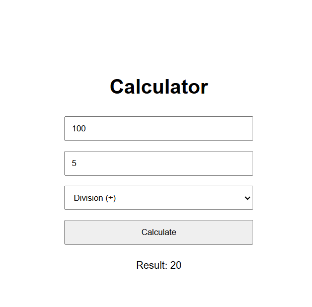

# Calculator

A simple web-based calculator built using HTML, CSS, and JavaScript.

## Features

- Addition
- Subtraction
- Multiplication
- Division
- Handles division by zero
- Handles invalid input
- Allows multiple calculations without restarting

## Technologies Used

- HTML
- CSS
- JavaScript

## How to Run

1. Clone the repository.
2. Open the project folder.
3. Open `index.html` in your browser.
4. Enter two numbers.
5. Select an operation.
6. Click the Calculate button.

## Screenshot

